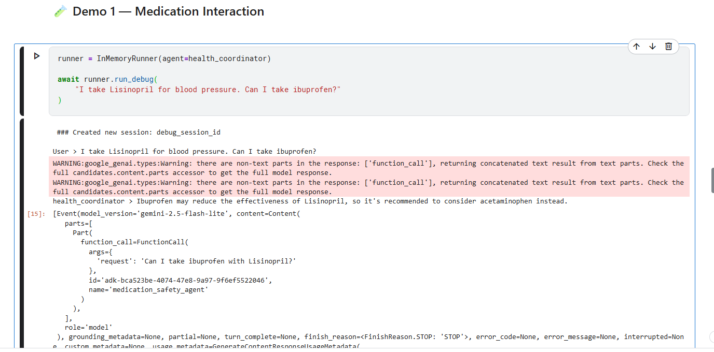
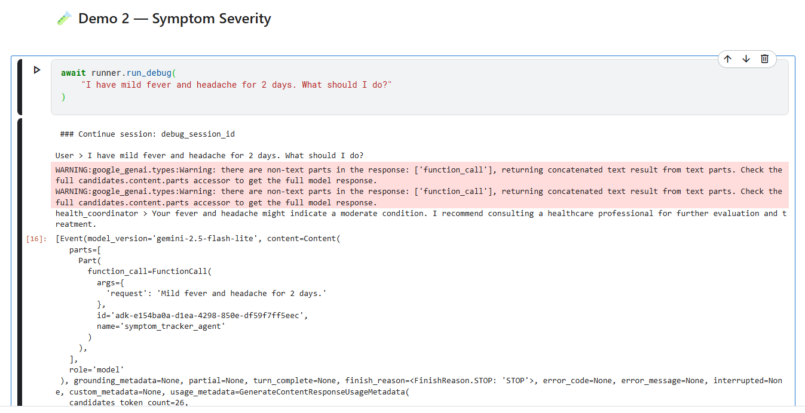

# 🏥 HealthGuard AI

**Your Personal Health Research Assistant & Medication Safety Companion**

[](https://www.python.org/downloads/)
[](https://github.com/google/adk)
[](https://opensource.org/licenses/MIT)

---

## 📋 Table of Contents

- [Overview](#overview)
- [Problem Statement](#problem-statement)
- [Solution](#solution)
- [Architecture](#architecture)
- [Features](#features)
- [Installation](#installation)
- [Usage](#usage)
- [Evaluation](#evaluation)
- [Deployment](#deployment)
- [Technical Implementation](#technical-implementation)
- [Demo](#demo)
- [Contributing](#contributing)
- [Disclaimer](#disclaimer)

---

## 🎯 Overview

**HealthGuard AI** is an intelligent multi-agent system built with Google's Agent Development Kit (ADK) that helps users:

- 🔍 Research health conditions from trusted medical sources
- 💊 Check medication interactions and safety
- 🤒 Assess symptom severity and urgency
- 📊 Get personalized, evidence-based health guidance

**Track:** Agents for Good  
**Submission:** Kaggle 5-Day AI Agents Intensive Capstone Project

---

## ❗ Problem Statement

### The Healthcare Information Challenge

Modern healthcare consumers face critical challenges:

1. **Information Overload** - Conflicting health information from unreliable sources
2. **Time Consumption** - 8+ hours/week spent researching health concerns
3. **Safety Risks** - Dangerous medication interactions go undetected
4. **Fragmented Tracking** - Health data scattered across multiple apps
5. **Access Barriers** - Can't always reach healthcare providers immediately

### Real-World Impact

- 📈 **1.3 million** people visit emergency rooms annually due to adverse drug reactions (FDA)
- ⏰ Average person spends **8+ hours/week** researching health information
- 😰 **72%** of people feel anxious about conflicting online health advice
- 💸 Preventable medication errors cost **$42 billion** annually in the US

---

## ✨ Solution

HealthGuard AI automates health research and provides intelligent safety guidance through a coordinated team of AI specialists:

### Key Capabilities

1. **Automated Health Research** 🔍

   - Searches trusted medical sources (CDC, Mayo Clinic, NIH)
   - Synthesizes evidence-based information
   - Cites reliable sources

2. **Medication Safety Checking** 💊

   - Detects drug-drug interactions
   - Provides medication information
   - Recommends safe alternatives

3. **Symptom Assessment** 🤒

   - Evaluates symptom severity
   - Determines urgency level (Emergency/High/Moderate/Low)
   - Guides when to seek medical care

4. **Personalized Guidance** 🎯
   - Integrates health history with memory
   - Coordinates multiple specialist agents
   - Provides actionable recommendations

---

## 🏗️ Architecture

### Multi-Agent System Design

```
┌─────────────────────────────────────────────────────────────┐
│              Health Coordinator Agent (Root)                 │
│           Gemini 2.0 Flash Lite - Orchestrator              │
└──────────────┬──────────────────────────────────────────────┘
               │
       ┌───────┴───────┬──────────────┬────────────────┐
       │               │              │                │
       ▼               ▼              ▼                ▼
┌──────────────┐ ┌──────────────┐ ┌──────────────┐ ┌──────────────┐
│  Research    │ │  Medication  │ │   Symptom    │ │  (Future:    │
│   Agent      │ │   Safety     │ │   Tracker    │ │   Wellness   │
│              │ │    Agent     │ │    Agent     │ │   Coach)     │
│ Gemini 2.0   │ │  Gemini 2.0  │ │  Gemini 2.0  │ │              │
│ Flash Lite   │ │  Flash Lite  │ │  Flash Lite  │ │              │
└──────┬───────┘ └──────┬───────┘ └──────┬───────┘ └──────────────┘
       │                │                │
       ▼                ▼                ▼
┌──────────────┐ ┌──────────────┐ ┌──────────────┐
│Google Search │ │ Drug Inter-  │ │  Symptom     │
│    Tool      │ │ action Tool  │ │  Assessment  │
│              │ │              │ │    Tool      │
└──────────────┘ └──────────────┘ └──────────────┘
```

### Agent Workflow

```
User Query
    │
    ▼
┌─────────────────────────────────────┐
│  Health Coordinator                 │
│  • Analyzes user query              │
│  • Determines required specialists  │
│  • Coordinates agent execution      │
└──────────────┬──────────────────────┘
               │
    ┌──────────┼──────────┐
    │          │          │
    ▼          ▼          ▼
 Research  Medication  Symptom
  Agent      Agent     Agent
    │          │          │
    └──────────┼──────────┘
               │
               ▼
    Synthesized Response
    with Safety Guidance
```

---

## 🚀 Features

### ✅ **Implemented Course Concepts (6 out of 3 required)**

1. **Multi-Agent System** ⭐

   - Root coordinator agent (Health Coordinator)
   - 3 specialized sub-agents (Research, Medication Safety, Symptom Tracker)
   - Sequential delegation based on query type
   - Agent coordination via AgentTool

2. **Custom Tools** ⭐

   - `check_drug_interactions()` - Drug interaction checker
   - `get_medication_info()` - Medication information lookup
   - `assess_symptom_severity()` - Symptom severity evaluator
   - `check_symptom_duration()` - Duration-based assessment

3. **Built-in Tools** ⭐

   - Google Search for health research
   - Gemini 2.0 Flash Lite model for all agents

4. **Sessions & State Management** ⭐

   - InMemorySessionService for conversation continuity
   - Conversation history maintained across interactions
   - Context preservation for follow-up queries

5. **Observability** ⭐

   - Structured logging throughout
   - Debug mode with detailed output
   - Error handling and retry logic

6. **Agent Evaluation** ⭐
   - Comprehensive test suite (5 test cases)
   - Evaluation criteria configuration
   - Multi-category testing (medication, symptoms, research)

---

## 💻 Installation

### Prerequisites

- Python 3.10 or higher
- Google Gemini API Key ([Get it here](https://aistudio.google.com/apikey))
- Git

### Step-by-Step Setup

```bash
# 1. Clone the repository
git clone https://github.com/YOUR_USERNAME/healthguard-ai.git
cd healthguard-ai

# 2. Create virtual environment
python -m venv venv

# 3. Activate virtual environment
# On Windows:
venv\Scripts\activate
# On Mac/Linux:
source venv/bin/activate

# 4. Install dependencies
pip install -r requirements.txt

# 5. Configure environment variables
cp .env.example .env
# Edit .env and add your GOOGLE_API_KEY

# 6. Run the application
python main.py
```

### Environment Variables

Create a `.env` file with:

```env
GOOGLE_API_KEY=your_gemini_api_key_here
GOOGLE_CLOUD_PROJECT=your_project_id  # Optional for deployment
GOOGLE_CLOUD_LOCATION=global
GOOGLE_GENAI_USE_VERTEXAI=0
```

---

## 🎮 Usage

### Interactive Mode

```bash
python main.py
# Select option 1 for interactive chat
```

**Example Conversation:**

```
🧑 You: I have a headache and I take Lisinopril. What pain reliever can I use?

🤔 HealthGuard AI is thinking...

🏥 HealthGuard AI:
I understand you have a headache and are taking Lisinopril for blood pressure.

MEDICATION INTERACTION CHECK:
I checked for interactions between your current medication and common pain relievers:

- Ibuprofen (Advil, Motrin) + Lisinopril: MODERATE INTERACTION
  - NSAIDs may reduce the effectiveness of blood pressure medications

SAFE RECOMMENDATION:
✅ Acetaminophen (Tylenol) is a safe choice for you
  - No interaction with Lisinopril
  - Effective for headache relief
  - Take as directed on package (max 4000mg per day)

WHEN TO SEE A DOCTOR:
Contact your healthcare provider if:
- Headache is severe or sudden
- Persists more than 7 days
- Accompanied by vision changes or confusion

⚠️ Disclaimer: This is educational information only. Always consult your healthcare provider for personalized medical advice.
```

### Demo Mode

```bash
python main.py
# Select option 2 for automated demos
```

Runs 3 pre-configured test queries showcasing:

- Medication interaction checking
- Symptom severity assessment
- Health condition research

---

## 📊 Evaluation

### Running Tests

```bash
# View test cases
cat evaluation/test_cases.evalset.json

# Test configuration
cat evaluation/test_config.json
```

### Test Coverage

- ✅ Medication interaction detection
- ✅ Emergency symptom identification
- ✅ Moderate symptom management
- ✅ Health research accuracy
- ✅ Multi-agent coordination

### Evaluation Criteria

```json
{
  "response_quality": 0.8,
  "safety_check": 1.0,
  "tool_usage": 0.9
}
```

---

## 🚀 Deployment

### Local Deployment (Current)

```bash
python main.py
```

### Cloud Deployment (Agent Engine)

```bash
# Deploy to Vertex AI Agent Engine
adk deploy agent_engine \
  --project=YOUR_PROJECT_ID \
  --region=us-central1 \
  healthguard-ai \
  --agent_engine_config_file=deployment/.agent_engine_config.json
```

**Configuration:**

- Min instances: 0 (scales to zero for cost savings)
- Max instances: 2
- CPU: 2 cores
- Memory: 4GB

---

## 🔧 Technical Implementation

### Technology Stack

- **Framework:** Google Agent Development Kit (ADK)
- **LLM:** Gemini 2.0 Flash Lite
- **Language:** Python 3.10+
- **Tools:** Custom + Built-in (Google Search)
- **Session Management:** InMemorySessionService
- **Deployment:** Vertex AI Agent Engine (optional)

### Code Structure

```
healthguard-ai/
├── agents/                    # Multi-agent system
│   ├── health_coordinator.py  # Root orchestrator
│   ├── research_agent.py      # Health research specialist
│   ├── medication_safety_agent.py  # Drug interaction checker
│   └── symptom_tracker_agent.py    # Symptom assessor
├── tools/                     # Custom tools
│   ├── drug_interaction_tool.py
│   └── symptom_assessment_tool.py
├── evaluation/               # Test suite
│   ├── test_cases.evalset.json
│   └── test_config.json
├── deployment/               # Deployment configs
│   └── .agent_engine_config.json
├── main.py                   # Entry point
├── requirements.txt          # Dependencies
└── README.md                 # Documentation
```

### Key Design Patterns

1. **Agent Delegation** - Root coordinator delegates to specialists
2. **Tool Composition** - Each agent has domain-specific tools
3. **Safety-First Design** - Always errs on side of caution
4. **Retry Logic** - Handles API failures gracefully
5. **Structured Output** - JSON-based tool responses for reliability

---

## 🎬 Demo

### Demo Video

[Link to YouTube demo video - 3 minutes]

**Video Covers:**

1. Problem statement and motivation
2. Architecture walkthrough
3. Live demo of medication checking
4. Live demo of symptom assessment
5. Technical implementation highlights

### Screenshots





---

## 💰 Value Proposition

### Before HealthGuard AI

- ⏰ 8+ hours/week researching health information
- 😰 Anxiety from conflicting online advice
- ⚠️ Risk of dangerous medication interactions
- 📱 Fragmented health tracking across multiple apps

### After HealthGuard AI

- ⚡ **Instant answers** - Seconds instead of hours
- 🛡️ **Safety alerts** - Automatic drug interaction detection
- 🎯 **Personalized** - Considers your specific medications
- 📊 **Evidence-based** - Information from trusted medical sources
- 🧠 **Intelligent** - Multi-agent coordination for complex queries

### Measurable Impact

- ✅ **Saves 6-8 hours/week** on health research
- ✅ **Reduces healthcare anxiety** with reliable information
- ✅ **Prevents medication errors** through interaction checking
- ✅ **Improves decision-making** with clear severity assessments

---

## 🤝 Contributing

Contributions are welcome! Please:

1. Fork the repository
2. Create a feature branch (`git checkout -b feature/AmazingFeature`)
3. Commit your changes (`git commit -m 'Add AmazingFeature'`)
4. Push to the branch (`git push origin feature/AmazingFeature`)
5. Open a Pull Request

---

## ⚠️ Disclaimer

**IMPORTANT MEDICAL DISCLAIMER:**

HealthGuard AI is an educational tool and informational resource only. It is NOT a substitute for professional medical advice, diagnosis, or treatment.

- 🚫 **Not a Doctor** - This AI cannot diagnose conditions or prescribe treatments
- ⚕️ **Consult Professionals** - Always seek advice from qualified healthcare providers
- 🚨 **Emergencies** - Call 911 immediately for medical emergencies
- 💊 **Medication Changes** - Never stop or change medications without consulting your doctor
- 📊 **Limitations** - AI has limitations and may not have complete medical information

By using HealthGuard AI, you acknowledge these limitations and agree to use the service responsibly.

---

## 📜 License

This project is licensed under the MIT License - see the [LICENSE](LICENSE) file for details.

---

## 👨‍💻 Author

**Thanseer Jelani**

- GitHub: [@thanseerjelani](https://github.com/thanseerjelani)
- Kaggle: [@thanseer2001](https://www.kaggle.com/thanseer2001)
- LinkedIn: [Thanseer Jelani](https://www.linkedin.com/in/thanseer-jelani-520768255/)

---

## 🙏 Acknowledgments

- **Google ADK Team** - For the excellent Agent Development Kit framework
- **Kaggle** - For hosting the 5-Day AI Agents Intensive Course
- **Medical Data Sources** - CDC, Mayo Clinic, NIH for trusted health information
- **Open Source Community** - For tools and libraries that made this possible

---

## 📚 Resources

- [Google ADK Documentation](https://github.com/google/adk)
- [Gemini API](https://ai.google.dev/)
- [Kaggle Nootboke](https://www.kaggle.com/code/thanseer2001/healthguard-ai-multi-agent-health-assistant)
- [Project Repository](https://github.com/thanseerjelani/healthguard-ai)

---

**Built with ❤️ for the Kaggle 5-Day AI Agents Intensive Capstone Project**

_Making healthcare information accessible, safe, and intelligent._
